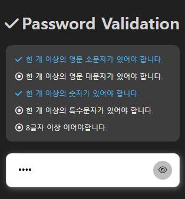

# Password Validation UI
Password Validation Check in Javascript

https://youtu.be/Hi8DVOaZ0Ug


```js
const lowr = new RegExp('(?=.*[a-z])'); /* 소문자포함 */
const uper = new RegExp('(?=.*[A-Z])'); /* 대문자포함 */
const numb = new RegExp('(?=.*[0-9])'); /* 숫자포함 */
const spcl = new RegExp('(?=.*[~!@#\$%\^&\*])'); /* 특수문자포함 */
const leng = new RegExp('(?=.{8,})');   /* 8자이상 */
```


